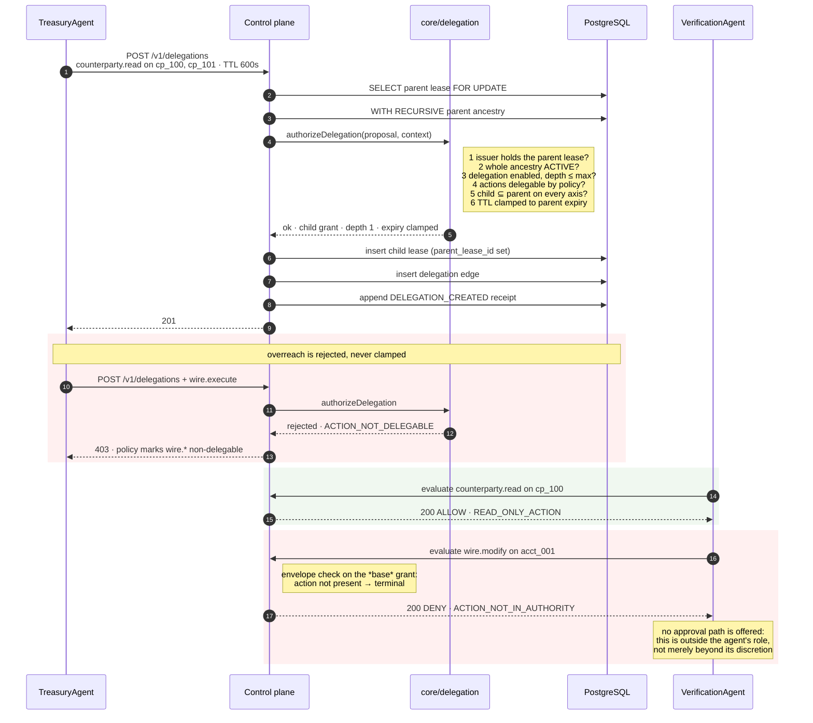
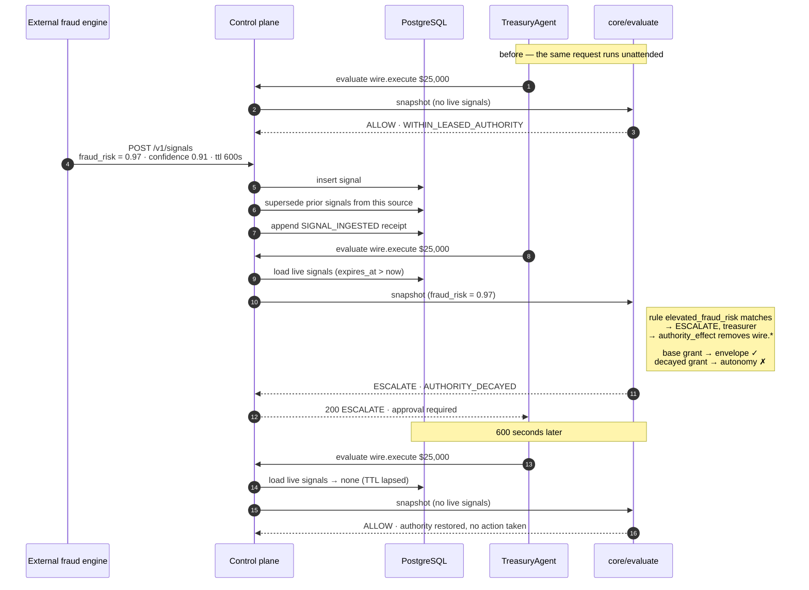
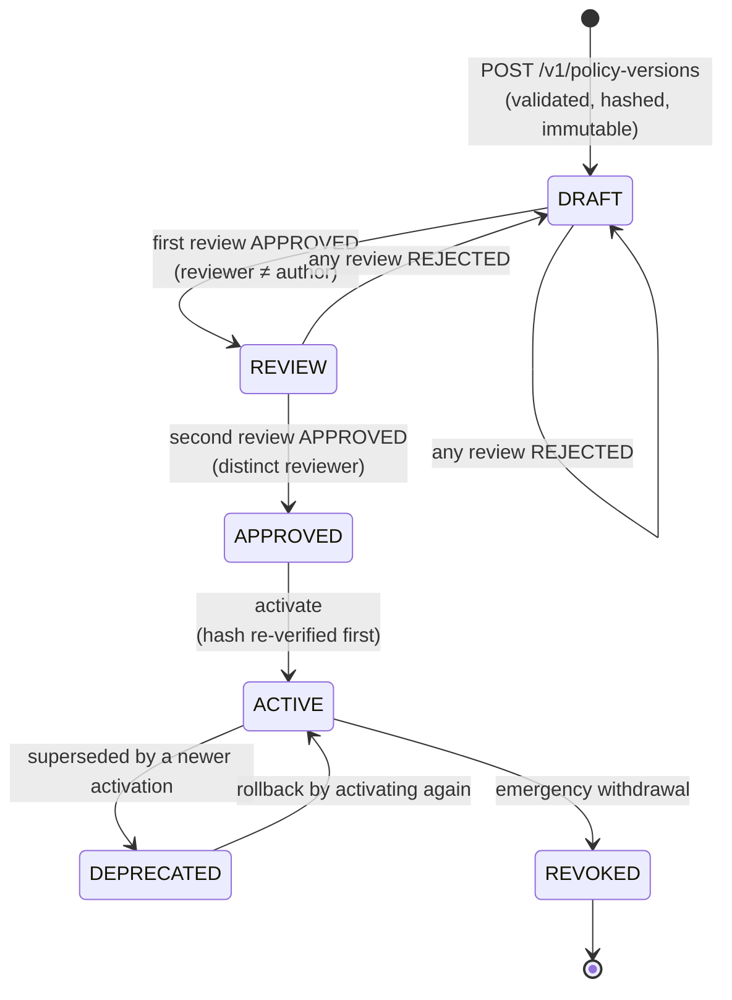
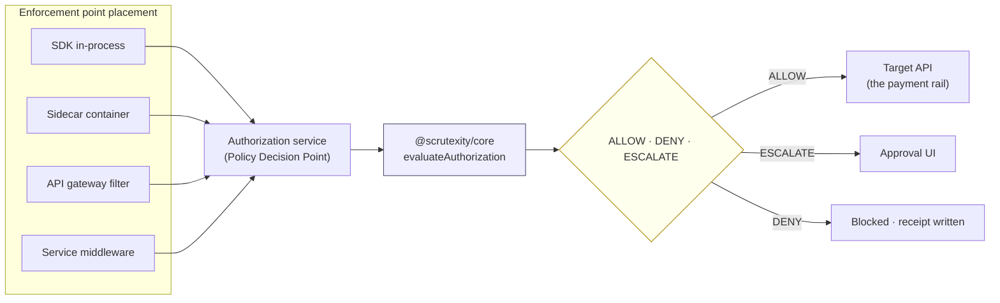

# Sequence diagrams

Mermaid. Every flow below is exercised by `make demo` and by the test suite.

## 1. The complete treasury wire flow

```mermaid
sequenceDiagram
    autonumber
    actor Ops as Treasury operator
    participant Agent as TreasuryAgent
    participant SDK as @scrutexity/sdk (PEP)
    participant API as Control plane
    participant PDP as @scrutexity/core (PDP)
    participant DB as PostgreSQL
    participant UI as Approval UI
    actor T as Treasurer

    rect rgb(245,245,245)
    note over Ops,DB: Agent identity, then authority issuance
    Ops->>API: POST /v1/agents
    API->>DB: insert agent (owner = a named human)
    Ops->>API: POST /v1/authority-leases
    note right of Ops: actions × resources × constraints,<br/>TTL 1h, derived from policy v1.4.0
    API->>DB: insert lease, append LEASE_ISSUED receipt
    API-->>Ops: lease_… expires 13:00Z
    end

    rect rgb(240,248,240)
    note over Agent,DB: A $25,000 wire — inside the agent discretion
    Agent->>SDK: authorize(wire.execute, acct_001, $25,000)
    SDK->>API: POST /v1/authorization/evaluate
    API->>DB: BEGIN; SET LOCAL scrutexity.org_id
    API->>DB: resolve agent · derive counterparty_known
    API->>DB: insert authorization_request (immutable)
    API->>DB: load policy version + verify content hash
    API->>DB: load leases WITH RECURSIVE ancestry
    API->>DB: load live signals (expires_at > now)
    API->>PDP: evaluateAuthorization(snapshot)
    PDP-->>API: ALLOW · WITHIN_LEASED_AUTHORITY
    API->>DB: insert decision · append receipt (chain head locked)
    API->>DB: COMMIT
    API-->>SDK: 200 ALLOW, expires_at +300s
    SDK->>Agent: proceed
    Agent->>SDK: wire sent
    SDK->>API: POST /v1/executions (single-use)
    API->>DB: insert execution · append EXECUTION receipt
    end

    rect rgb(255,250,235)
    note over Agent,T: A $75,000 wire — beyond discretion; the treasurer approves
    Agent->>SDK: authorize(wire.execute, acct_001, $75,000)
    SDK->>API: POST /v1/authorization/evaluate
    API->>PDP: evaluateAuthorization(snapshot)
    note right of PDP: envelope ✓ · ceiling ✗<br/>policy: ESCALATE, treasurer
    PDP-->>API: ESCALATE · TREASURER_APPROVAL_REQUIRED
    API->>DB: insert decision · insert approval_request · append receipt
    API-->>SDK: 200 ESCALATE (no execution grant)
    SDK-->>Agent: not allowed; approval pending
    API-->>UI: appears in GET /v1/approval-requests
    T->>UI: review
    T->>API: POST /v1/approvals {APPROVED}
    API->>DB: insert approval (roles snapshotted) · append APPROVAL receipt
    API->>PDP: re-evaluate with prior approvals
    PDP-->>API: ALLOW · APPROVED_BY_HUMAN
    API->>DB: insert superseding decision · append receipt
    note over DB: the escalated decision is never rewritten
    API-->>T: 201 · decision now ALLOW
    end

    rect rgb(250,240,240)
    note over Ops,DB: Evidence
    Ops->>API: POST /v1/receipts/{id}/verify
    API->>DB: read receipt + preceding chain segment
    API->>PDP: verifyReceipt · verifyChain
    PDP-->>API: payload digest ✓ link hash ✓ signature ✓ linkage ✓
    API-->>Ops: INTACT · attests evidence_integrity_and_provenance
    end
```

## 2. Delegation, and the violation it prevents



## 3. Authority decay from a risk signal



## 4. Revocation propagating through a delegation chain

```mermaid
sequenceDiagram
    autonumber
    actor Ops as Security operator
    participant API as Control plane
    participant DB as PostgreSQL
    participant VA as VerificationAgent (depth 1)

    Ops->>API: POST /v1/authority-leases/{parent}/revoke
    API->>DB: UPDATE status = REVOKED, revoked_at = now()
    API->>DB: append LEASE_REVOKED receipt (descendants recorded)
    note over DB: descendant rows are NOT modified

    VA->>API: evaluate counterparty.read (child lease still ACTIVE)
    API->>DB: WITH RECURSIVE ancestry of the child lease
    note right of API: evaluateChain walks leaf → root;<br/>the root reads REVOKED,<br/>so the whole chain is unusable
    API-->>VA: 200 DENY · AUTHORITY_REVOKED

    note over Ops,VA: no cascade job, no cache to invalidate.<br/>the window is one committed transaction.
```

## 5. Policy lifecycle under dual control



## 6. Deployment models the semantics must survive



The point of the diagram: every placement calls the _same_ pure function.
Moving the enforcement point closer to or further from the action changes
latency and blast radius. It never changes the answer.
